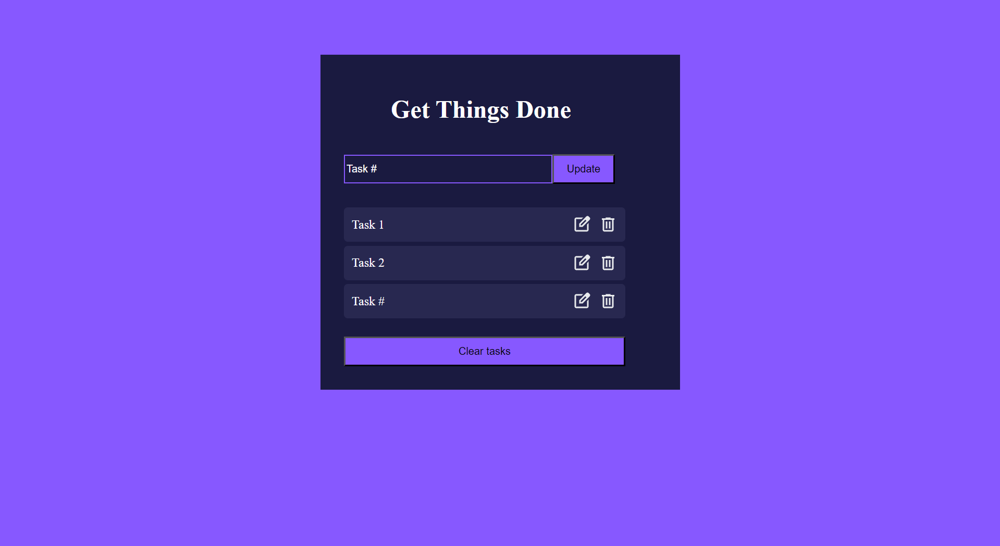

# ToDo App

A simple and efficient ToDo application built with React and Vite.

## Table of Contents

- [Installation](#installation)
- [Usage](#usage)
- [Contributing](#contributing)
## Installation

Follow these steps to set up the project on your local machine.

1. Clone the repository:

    ```bash
    git clone https://github.com/yourusername/todo-app.git
    ```

2. Navigate to the project directory:

    ```bash
    cd todo-app
    ```

3. Install dependencies:

    ```bash
    npm install
    ```

## Usage

Instructions on how to run the project.

1. Start the development server:

    ```bash
    npm run dev
    ```

2. Open your browser and navigate to:

    ```
    http://localhost:3000
    ```

## Screenshot



## Contributing

Guidelines for contributing to the project.

1. Fork the repository
2. Create your feature branch (`git checkout -b feature/AmazingFeature`)
3. Commit your changes (`git commit -m 'Add some AmazingFeature'`)
4. Push to the branch (`git push origin feature/AmazingFeature`)
5. Open a pull request


# React + Vite

This template provides a minimal setup to get React working in Vite with HMR and some ESLint rules.

Currently, two official plugins are available:

- [@vitejs/plugin-react](https://github.com/vitejs/vite-plugin-react/blob/main/packages/plugin-react/README.md) uses [Babel](https://babeljs.io/) for Fast Refresh
- [@vitejs/plugin-react-swc](https://github.com/vitejs/vite-plugin-react-swc) uses [SWC](https://swc.rs/) for Fast Refresh


Here's a README template tailored for a ToDo app built with React and Vite, including instructions for adding a screenshot.

---
